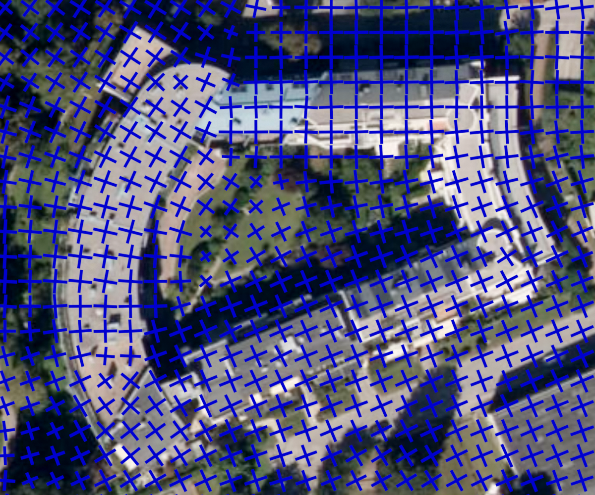
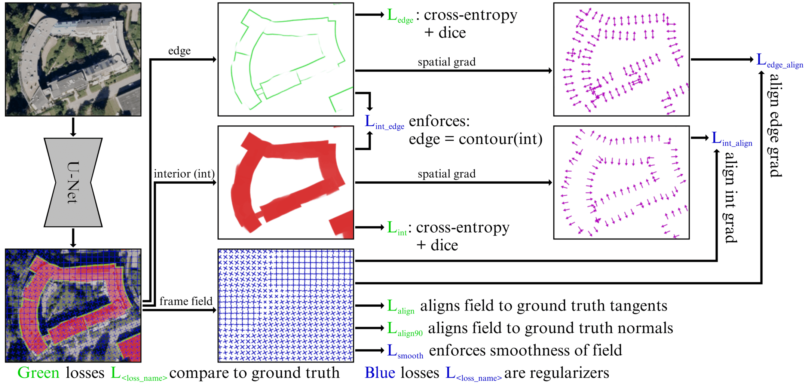
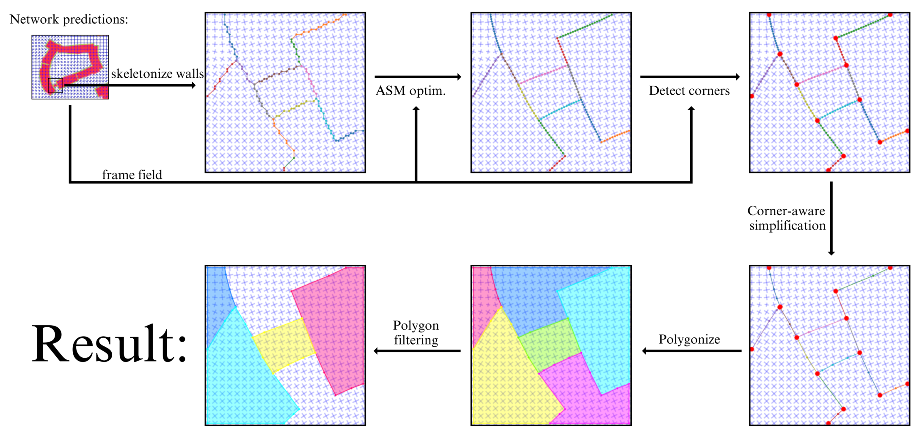

:warning: Development branch

# Polygonal Building Segmentation by Frame Field Learning

We add a frame field output to an image segmentation neural network to improve segmentation quality 
and provide structural information for the subsequent polygonization step.

<p align="center">
    
    <br>
    Figure 1: Close-up of our additional frame field output on a test image.
    <br>
    <br>
    <br>
    
    <br>
    Figure 2: Given an overhead image, the model outputs an edge mask, an interior mask,
    and a frame field for buildings. The total loss includes terms that align the masks and
    frame field to ground truth data as well as regularizers to enforce smoothness of the
    frame field and consistency between the outputs.
    <br>
    <br>
    <br>
    
    <br>
    Figure 3: Given classification maps and a frame field as input, we optimize skeleton polylines to
    align to the frame field using an Active Skeleton Model (ASM) and detect corners using
    the frame field, simplifying non-corner vertices.
</p>

This repository contains the official code for the paper:

**Polygonal Building Segmentation by Frame Field Learning**\
[Nicolas Girard](https://www-sop.inria.fr/members/Nicolas.Girard/),
[Dmitriy Smirnov](https://people.csail.mit.edu/smirnov/),
[Justin Solomon](https://people.csail.mit.edu/jsolomon/),
[Yuliya Tarabalka](https://www-sop.inria.fr/members/Yuliya.Tarabalka/)\
Pre-print\
**\[[paper](https://arxiv.org/pdf/2004.14875.pdf), [video](https://www.youtube.com/watch?v=XdQMD3HTYCU&t=5s)\]**

Whose short version has been published as:

**Regularized Building Segmentation by Frame Field Learning**\
[Nicolas Girard](https://www-sop.inria.fr/members/Nicolas.Girard/),
[Dmitriy Smirnov](https://people.csail.mit.edu/smirnov/),
[Justin Solomon](https://people.csail.mit.edu/jsolomon/),
[Yuliya Tarabalka](https://www-sop.inria.fr/members/Yuliya.Tarabalka/)\
IGARSS 2020

# Setup

## Git submodules

This project uses various git submodules that should be cloned too.

To clone a repository including its submodules execute:
```
git clone --recursive --jobs 8 <URL to Git repo>
```

If you already have cloned the repository and now want to load it’s submodules execute:
```
git submodule update --init --recursive --jobs 8
```
or:
```
git submodule update --recursive
```

For more about explanations about using submodules and git, see [SUBMODULES.md](SUBMODULES.md).

## Docker

The easiest way to setup environment is to use the Docker image provided in the [docker](docker) (see README inside the folder).

Once the docker container is built and launched, execute the [setup.sh](setup.sh) script inside to install required packages.

The environment in the container is now ready for use.

# Data

Several datasets are used in this work. 
We typically put all datasets in a "data" folder which we link to the "/data" folder in the container (with the ```-v``` argument when running the container).
Each dataset has it's own sub-folder, usually named with a short version of that dataset's name. 
Each dataset sub-folder should have a "raw" folder inside containing all the original folders and files fo the datset.
When pre-processing data, "processed" folders will be created alongside the "raw" folder.

For example, the CrowdAI Mapping Challenge dataset should have the following file structure inside the container:

```
/data 
`-- mapping_challenge_dataset
     |-- raw
         |-- train
         |   |-- images
         |   |-- annotation.json
         |   `-- annotation-small.json
         `-- val
              `-- ...
```

If however you would like to use a different folder for the datasets (for example while not using Docker), 
you can change the path to datasets in config files.
You can modify the "data_dir_candidates" list in the config to only include your path. 
The training script checks this list of paths one at a time and picks the first one that exists. 
It then appends the "data_root_partial_dirpath" directory to get to the dataset.

# Running the main.py script

Execute [main.py](main.py) script to train a model, test a model or use a model on your own image.
See the help of the main script with:

```python main.py --help```

The script can be launched on multiple GPUs for multi-GPU training and evaluation.
Simply set the ```--gpus``` argument to the number of gpus you want to use. 
However, for the first launch of the script on a particular dataset (when it will pre-process the data), 
it is best to leave it at 1 as I did not implement multi-GPU synchronization when pre-processing datasets.

An example use is for training a model with a certain config file, like so:
```python main.py --config configs/config.mapping_dataset.unet_resnet101_pretrained```
which will train the Unet-Resnet101 on the CrowdAI Mapping Challenge dataset.
The batch size can be adjusted like so:
```python main.py --config configs/config.mapping_dataset.unet_resnet101_pretrained -b <new batch size>```

When training is done, the script can be launched in eval mode, to evaluate the trained model:
```python main.py --config configs/config.mapping_dataset.unet_resnet101_pretrained --mode eval```.
Depending on the eval parameters of the config file, running this will output results on the test dataset.

Finally, if you wish to compute AP and AR metrics with the COCO API, you can run:
```python main.py --config configs/config.mapping_dataset.unet_resnet101_pretrained --mode eval_coco```.

## Launch inference on one image

Make sure the run folder has the correct structure:

```
Polygonization-by-Frame-Field-Learning
|-- frame_field_learning
|   |-- runs
|   |   |-- <run_name> | <yyyy-mm-dd hh:mm:ss>
|   |   `-- ...
|   |-- inference.py
|   `-- ...
|-- main.py
|-- README.md (this file)
`-- ...
```

Execute the [main.py] script like so (filling values for arguments run_name and in_filepath):
```python main.py --run_name <run_name> --in_filepath <your_image_filepath>```

The outputs will be saved next to the input image

## Download trained models

We provide already-trained models so you can run inference right away. Download here: [https://drive.google.com/drive/folders/1poTQbpCz12ra22CsucF_hd_8dSQ1T3eT?usp=sharing](https://drive.google.com/drive/folders/1poTQbpCz12ra22CsucF_hd_8dSQ1T3eT?usp=sharing).
Each model was trained in a "run", whose folder (named with the format ```<run_name> | <yyyy-mm-dd hh:mm:ss>```) you can download at the provided link.
You should then place those runs in a folder named "runs" inside the "frame_field_learning" folder like so:
```
Polygonization-by-Frame-Field-Learning
|-- frame_field_learning
|   |-- runs
|   |   |-- inria_dataset_polygonized.unet_resnet101_pretrained.leaderboard | 2020-06-02 07:57:31
|   |   |-- mapping_dataset.unet_resnet101_pretrained.field_off.train_val | 2020-05-21 08:33:20
|   |   |-- mapping_dataset.unet_resnet101_pretrained.train_val | 2020-05-21 08:32:48
|   |   `-- ...
|   |-- inference.py
|   `-- ...
|-- main.py
|-- README.md (this file)
`-- ...
```

# Cite:

If you use this code for your own research, please cite

```
@InProceedings{Girard_2020_IGARSS,
  title = {{Regularized Building Segmentation by Frame Field Learning}},
  author = {Girard, Nicolas and Smirnov, Dmitriy and Solomon, Justin and Tarabalka, Yuliya},
  booktitle = {IEEE International Geoscience and Remote Sensing Symposium (IGARSS)},
  ADDRESS = {Waikoloa, Hawaii},
  year = {2020},
  month = Jul,
}

@misc{girard2020polygonal,
    title={Polygonal Building Segmentation by Frame Field Learning},
    author={Nicolas Girard and Dmitriy Smirnov and Justin Solomon and Yuliya Tarabalka},
    year={2020},
    eprint={2004.14875},
    archivePrefix={arXiv},
    primaryClass={cs.CV}
}
```